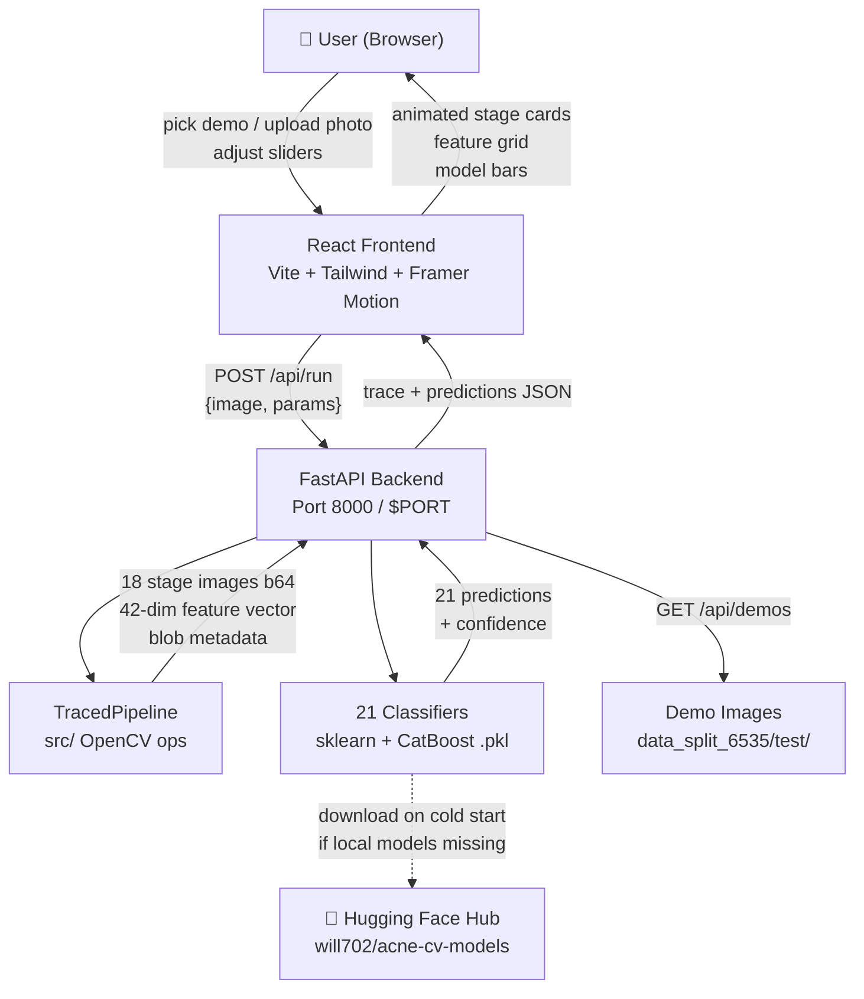
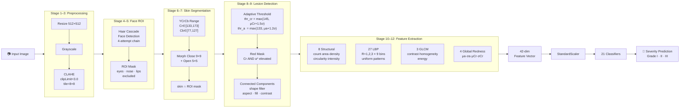
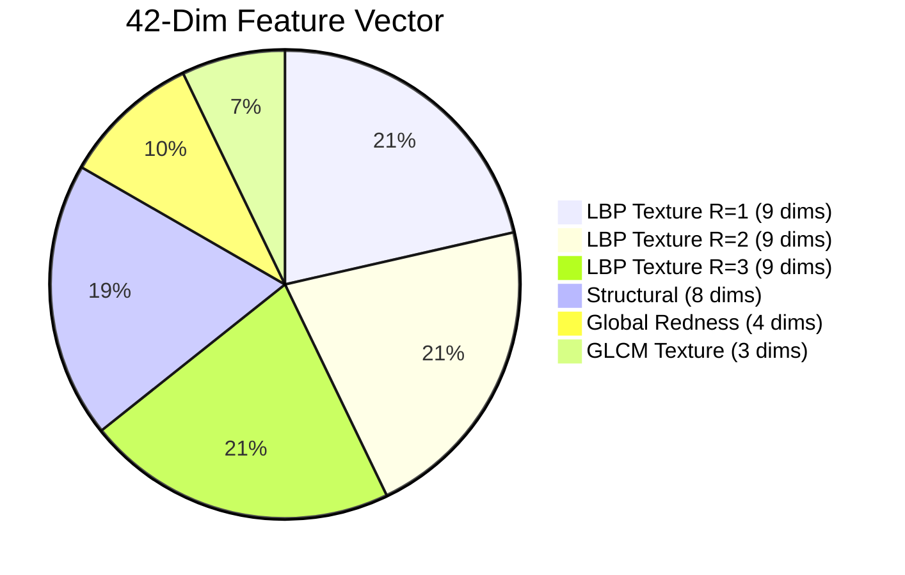
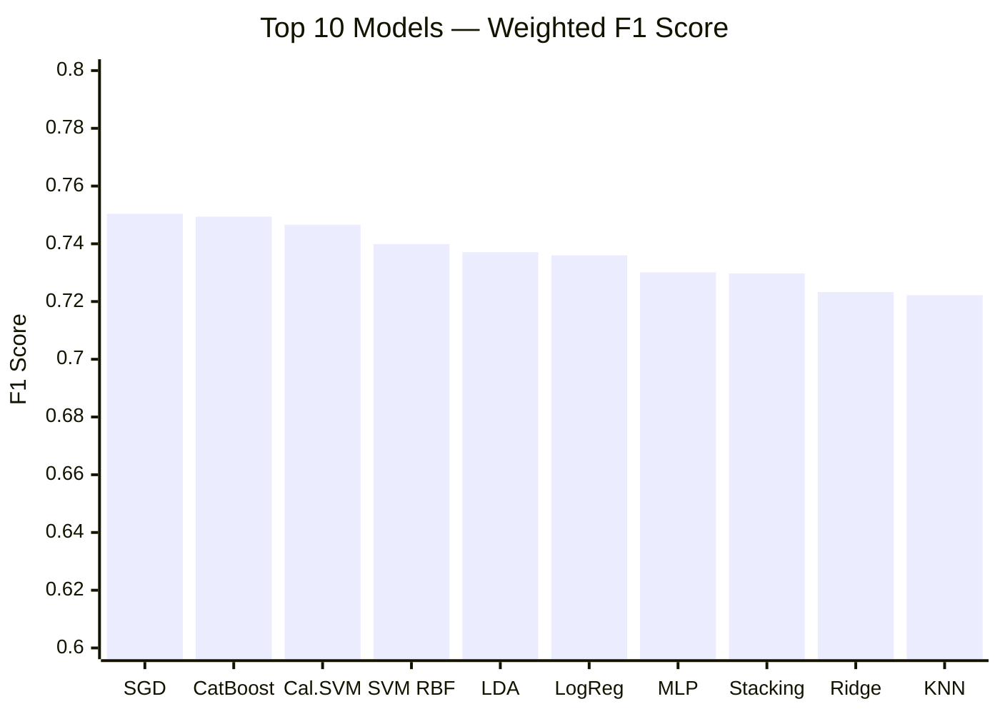
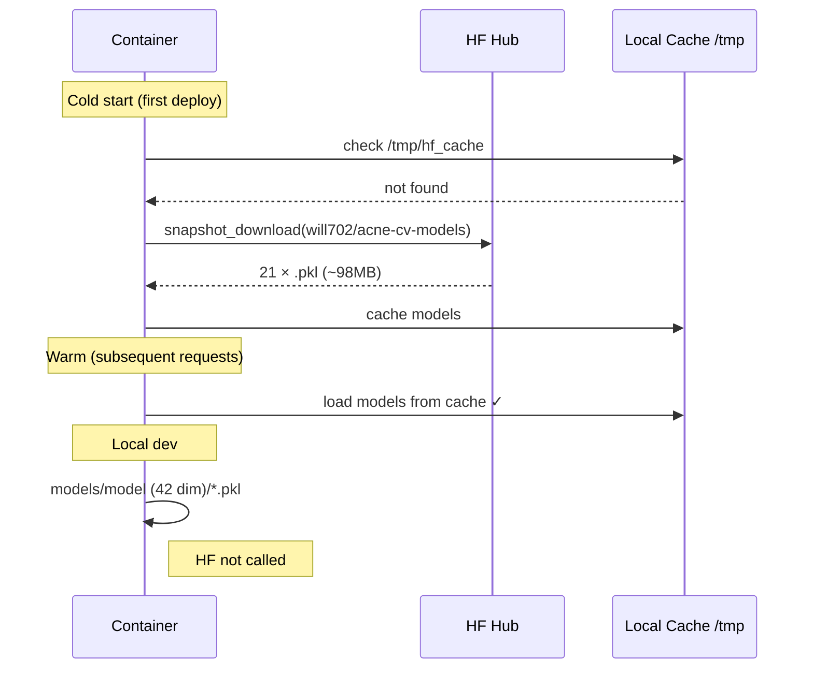

# Acne Detection CV Playground

An **interactive web playground** that walks through every stage of a computer-vision acne severity classification pipeline — from raw pixels to prediction — with live parameter sliders, a 42-dim feature inspector, and 21 classifier comparisons.

> **Models on Hugging Face →** [will702/acne-cv-models](https://huggingface.co/will702/acne-cv-models)

---

## How It Works

### System Architecture



### ML Pipeline (12 Stages)



### Feature Vector Breakdown



### Model Performance



### Cold Start vs Warm Request Flow



---

## Project Structure

```
comvis-research/
├── src/
│   ├── preprocessing.py     # FaceProcessor — CLAHE, face detect, skin seg
│   ├── features.py          # FeatureExtractor — 42-dim vector
│   └── config.py            # paths, class names
├── backend/
│   ├── app.py               # FastAPI routes + static file serving
│   ├── pipeline.py          # TracedPipeline — captures all intermediates
│   ├── models.py            # load 21 .pkl + HF Hub download fallback
│   ├── params.py            # PipelineParams dataclass (14 knobs)
│   ├── encode.py            # ndarray → base64 PNG helpers
│   └── test_pipeline.py     # fidelity guard: traced ≈ original
├── frontend/
│   ├── src/
│   │   ├── App.tsx
│   │   ├── components/
│   │   │   ├── StageStrip.tsx       # 12 animated pipeline stages
│   │   │   ├── ParamPanel.tsx       # 14 live sliders
│   │   │   ├── FeatureInspector.tsx # 42-dim interactive grid
│   │   │   ├── ModelCompare.tsx     # 21 classifier table
│   │   │   └── ImagePicker.tsx      # demo gallery + drag-drop upload
│   │   └── lib/api.ts               # typed fetch client
│   └── ...
├── models/
│   └── model (42 dim)/      # 21 × .pkl (local dev only, not in git)
├── data_split_6535/test/    # demo images (acne1/2/3)
├── scripts/
│   └── upload_models_hf.py  # one-time HF Hub upload
├── Dockerfile               # multi-stage: node build → python slim
├── fly.toml                 # Fly.io config
├── railway.toml             # Railway config
├── .github/workflows/
│   └── cloud-run.yml        # Google Cloud Run CI/CD
├── requirements.txt
└── start.sh                 # local dev server
```

---

## Local Setup

### Prerequisites
- Python 3.11+
- Node.js 20+
- [uv](https://github.com/astral-sh/uv) (or pip)

### 1. Clone & create venv

```bash
git clone https://github.com/will702/comvis-research
cd comvis-research
uv venv .venv
uv pip install -r requirements.txt --python .venv/bin/python3
```

### 2. Get models

**Option A — local** (if you have the trained models):
```bash
# models/model (42 dim)/*.pkl must exist
# Already present if you trained locally
```

**Option B — download from Hugging Face**:
```bash
export HF_MODEL_REPO=will702/acne-cv-models
# Backend downloads automatically on first start
```

### 3. Build frontend

```bash
cd frontend
npm install
npm run build
cd ..
```

### 4. Start server

```bash
./start.sh
# → http://localhost:8000
```

### Dev mode (hot reload on both sides)

```bash
# Terminal 1 — backend
.venv/bin/python3 -m uvicorn backend.app:app --reload

# Terminal 2 — frontend
cd frontend && npm run dev
# → http://localhost:5173  (proxies API to :8000)
```

### Run fidelity tests

```bash
.venv/bin/python3 -m pytest backend/test_pipeline.py -v
# 5/5 pass: TracedPipeline ≈ FeatureExtractor.extract() within 1e-5
```

---

## Deployment

> **Models are NOT in the Docker image.** Set `HF_MODEL_REPO=will702/acne-cv-models` on your host — container downloads ~98MB from HF Hub on first cold start.

### Option 1 — Railway (easiest)

```bash
npm install -g @railway/cli
railway login
railway init
railway up
```

Set env var in Railway dashboard → Service → Variables:
```
HF_MODEL_REPO=will702/acne-cv-models
```

Requires **1GB RAM** minimum (set in Railway service settings).

---

### Option 2 — Fly.io

```bash
brew install flyctl
fly auth login
fly launch        # detects Dockerfile, edit fly.toml app name first
fly secrets set HF_MODEL_REPO=will702/acne-cv-models
fly deploy
```

Config in `fly.toml` already sets `memory = "2gb"`.

---

### Option 3 — Google Cloud Run

```bash
# One-time setup
gcloud auth login
gcloud config set project YOUR_PROJECT_ID
gcloud services enable run.googleapis.com

# Build & deploy
docker build -t gcr.io/YOUR_PROJECT_ID/acne-cv-playground .
docker push gcr.io/YOUR_PROJECT_ID/acne-cv-playground

gcloud run deploy acne-cv-playground \
  --image gcr.io/YOUR_PROJECT_ID/acne-cv-playground \
  --region asia-southeast1 \
  --allow-unauthenticated \
  --memory 2Gi \
  --set-env-vars HF_MODEL_REPO=will702/acne-cv-models
```

**CI/CD (auto-deploy on push to `main`):** add these GitHub secrets:
| Secret | Value |
|---|---|
| `GCP_PROJECT_ID` | your GCP project ID |
| `GCP_SA_KEY` | JSON key with Cloud Run Admin + Storage Admin roles |

`.github/workflows/cloud-run.yml` handles the rest.

---

### Resource requirements

| | Min RAM | Cold start | Notes |
|---|---|---|---|
| Railway | 1 GB | ~45s | $5/mo free credit |
| Fly.io | 2 GB | ~45s | `shared-cpu-1x` + `2gb` memory |
| Cloud Run | 2 GB | ~45s | scales to 0, pay-per-request |

---

## Retrain & Re-upload Models

```bash
# 1. Retrain (uses existing src/ pipeline)
.venv/bin/python3 src/train.py

# 2. Re-upload to HF Hub
huggingface-cli login
python scripts/upload_models_hf.py --repo will702/acne-cv-models

# 3. Restart deployed container — it pulls fresh models on next cold start
```

---

## Dataset

[ACNE04](https://drive.google.com/drive/folders/18yJcHXhzOv7H89t-Z8tMaJR3PJtVblSH) — 3 severity grades used (acne1/2/3 = mild/moderate/severe).

```
Wu, X. et al. "Joint Acne Image Grading and Counting via Label Distribution Learning." ICCV 2019.
```

---

## Tech Stack

| Layer | Stack |
|---|---|
| Frontend | React 18 · Vite · TypeScript · Tailwind CSS · Framer Motion |
| Backend | FastAPI · Uvicorn · Python 3.13 |
| CV | OpenCV · scikit-image (LBP/GLCM) |
| ML | scikit-learn 1.7.2 · CatBoost · joblib |
| Models | Hugging Face Hub ([will702/acne-cv-models](https://huggingface.co/will702/acne-cv-models)) |
| Deploy | Docker · Google Cloud Run · Railway · Fly.io |
